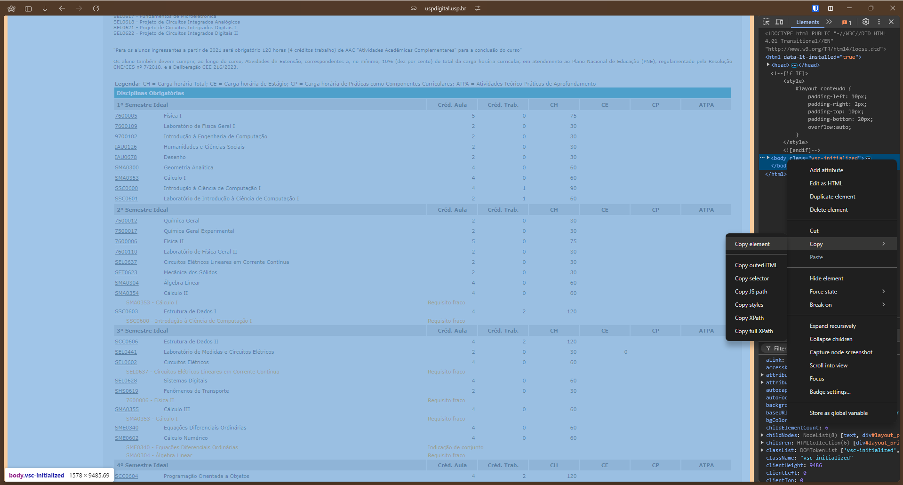

Para atualizar a lista de disciplinas abra a página do JupiterWeb e copie o código fonte da página como visto na imagem abaixo. Em seguida cole o código no arquivo `grade_curricular.html` e execute o script `parse_curriculum.py`. O script irá gerar um arquivo `parsed_subjects.json` com a lista de disciplinas.

